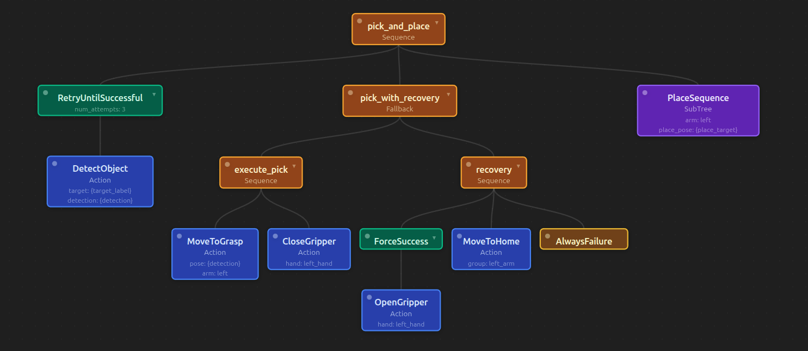
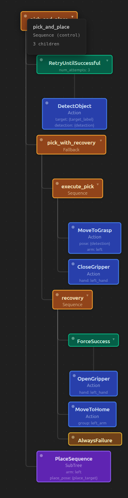

# BehaviorTree Viewer


> **Early access** -- actively in testing, expect bugs. Feedback welcome.

A free, open-source VSCode extension for visualizing and monitoring [BehaviorTree.CPP](https://www.behaviortree.dev/) v4 XML files. A lightweight alternative to Groot2.

| Horizontal (small trees) | Waterfall (large trees) |
|---|---|
|  |  |

## Features

**Tree Visualization**
- Parses BehaviorTree.CPP v4 XML and renders an interactive tree diagram
- Color-coded nodes by category: Control (orange), Decorator (green), Action (blue), Condition (yellow), SubTree (purple), Script (grey)
- Drag nodes to rearrange the layout; overlapping nodes auto-resolve
- Collapse/expand subtrees with double-click
- Inline SubTree expansion

**Blackboard Inspector**
- Lists all `{variable}` references found in the tree
- Shows which nodes read and write each variable

**Node Palette**
- Displays all node types from the `TreeNodesModel` section
- Grouped by category with port definitions (name, type, direction, defaults)

**Search**
- Filter nodes by name, type, or port values
- Matching nodes highlighted; non-matches dimmed

**Live Monitor** (requires ZMQ)
- Connects to a running BT.CPP process via ZMQ (same protocol as Groot2)
- Real-time node status overlay: Running (pulsing blue), Success (green), Failure (red), Idle (dimmed)
- Loads the live tree with correct UIDs for accurate status mapping

**Multi-tree Support**
- Dropdown selector for XML files containing multiple `<BehaviorTree>` definitions

## Usage

1. Open any BehaviorTree.CPP v4 XML file in VSCode
2. Open the viewer using any of:
   - **Editor title bar**: click the tree icon (top-right, appears on XML files)
   - **Right-click menu**: "Open Behavior Tree Viewer" (editor or explorer)
   - **Keyboard**: `Ctrl+Shift+T` (`Cmd+Shift+T` on Mac) when an XML file is active
   - **Command palette**: `BehaviorTree: Open Behavior Tree Viewer`

### Keyboard shortcuts (in the viewer)

| Key | Action |
|-----|--------|
| `F` | Fit tree to view |
| `R` | Reset layout |
| `+` / `-` | Zoom in / out |
| `0` | Reset zoom to 100% |
| `Ctrl+F` | Focus search box |
| `Esc` | Clear search |
| Scroll wheel | Zoom toward cursor |
| Click + drag (background) | Pan |
| Click + drag (node) | Move node/subtree |
| Double-click (node) | Collapse/expand children |

## Configuration

Set in VSCode Settings (`Ctrl+,`) under "BehaviorTree Viewer", or in `.vscode/settings.json`:

```jsonc
{
  // Host for live BT.CPP ZMQ monitor connection
  "behaviortreeViewer.monitorHost": "localhost",

  // Port for BT.CPP ZMQ monitor (REP socket; SUB socket is port+1)
  "behaviortreeViewer.monitorPort": 1666
}
```

For monitoring a remote BT process, set `monitorHost` to the target machine's IP address.

## Supported XML format

The extension supports BehaviorTree.CPP v4 XML with:

- `<root BTCPP_format="4">` wrapper
- `<BehaviorTree ID="...">` definitions (one or more per file)
- `<TreeNodesModel>` section for node type metadata
- `<SubTree ID="..."/>` references (expandable inline)
- All built-in BT.CPP node types (Sequence, Fallback, Parallel, Repeat, Retry, etc.)
- Custom action/condition nodes (auto-detected from TreeNodesModel or defaulted to action)

## Dependencies

- [fast-xml-parser](https://github.com/NaturalIntelligence/fast-xml-parser) for XML parsing
- [zeromq](https://github.com/zeromq/zeromq.js) for live monitoring (optional; monitor button is non-functional without it)

## Acknowledgements

- [BehaviorTree.CPP](https://github.com/BehaviorTree/BehaviorTree.CPP) by Davide Faconti and contributors (MIT License) -- the behavior tree library this extension visualizes. Live monitoring uses the Groot2 ZMQ protocol.
- [ZeroMQ](https://zeromq.org/) (MPL-2.0) -- messaging library for live monitoring
- [fast-xml-parser](https://github.com/NaturalIntelligence/fast-xml-parser) (MIT) -- XML parsing

## Built with AI

This extension was built with [Claude Code](https://claude.ai/code) (Anthropic).

## License

MIT
